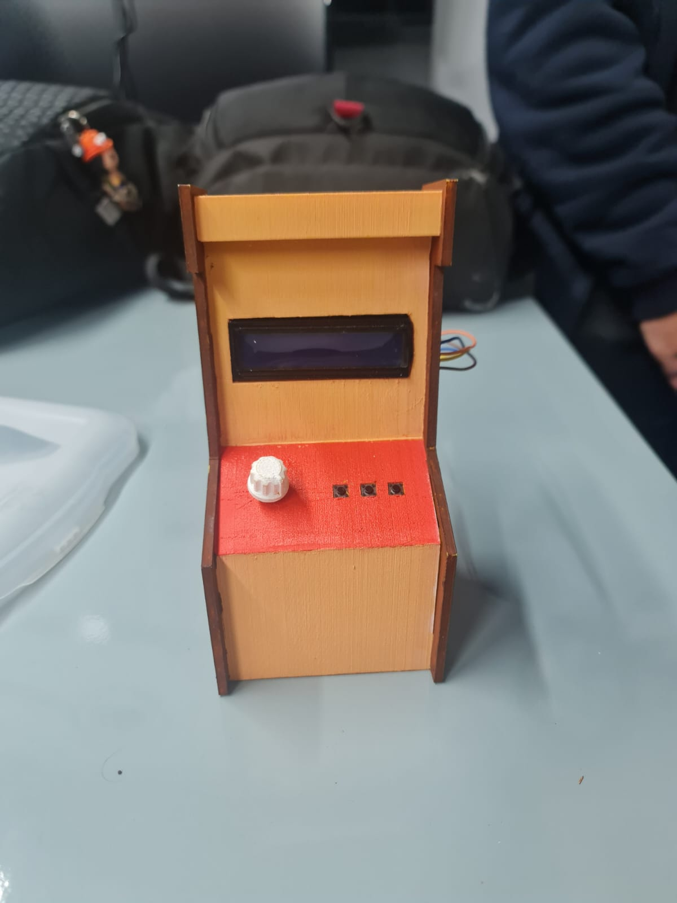

🎶 Controle de Volume e Música com Arduino e Python

Este projeto integra um Arduino a um script em Python para controlar o volume do sistema e a reprodução de músicas no computador.
A comunicação é feita via serial, onde o Arduino envia comandos que são interpretados pelo Python para:

Ajustar o volume do sistema (0 a 100%)

Pausar/retomar a música

Avançar ou retroceder faixas

🚀 Funcionalidades

🎚️ Controle de volume do Windows via potenciômetro.

⏯️ Pausar e retomar a reprodução.

⏮️ Voltar para a música anterior.

⏭️ Avançar para a próxima música.

🛠️ Tecnologias Utilizadas

Python

pycaw
 (controle de áudio)

pyautogui
 (atalhos de teclado para multimídia)

pyserial
 (comunicação com Arduino)

Arduino (responsável pela leitura do potenciômetro e envio de comandos via porta serial)

📦 Instalação e Uso

Clonar este repositório

git clone https://github.com/seu-usuario/seu-repositorio.git
cd seu-repositorio

Instalar dependências do Python

pip install pyserial pycaw pyautogui comtypes

Conectar o Arduino na porta serial correta (ajuste "COM3" no código se necessário).

Executar o script Python

python main.py

⚡ Como Funciona

O Arduino envia valores analógicos (0.0 a 1.0) representando o volume.

Quando botões são pressionados no Arduino, são enviados comandos como:

CMD:BACK → Voltar faixa

CMD:PAUSE → Pausar/Play

CMD:NEXT → Próxima faixa

O Python interpreta esses comandos e controla o áudio do Windows.

📌 Exemplo de Saída no Terminal
Volume ajustado para: 0.45
Comando: Pausar/Play
Comando: Próxima música

